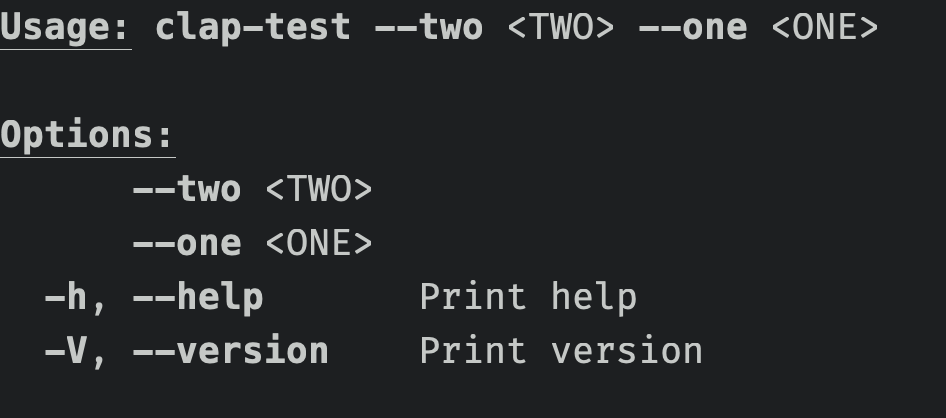
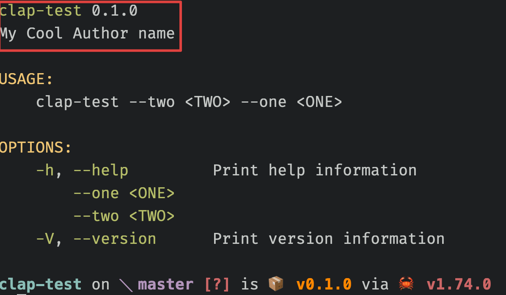
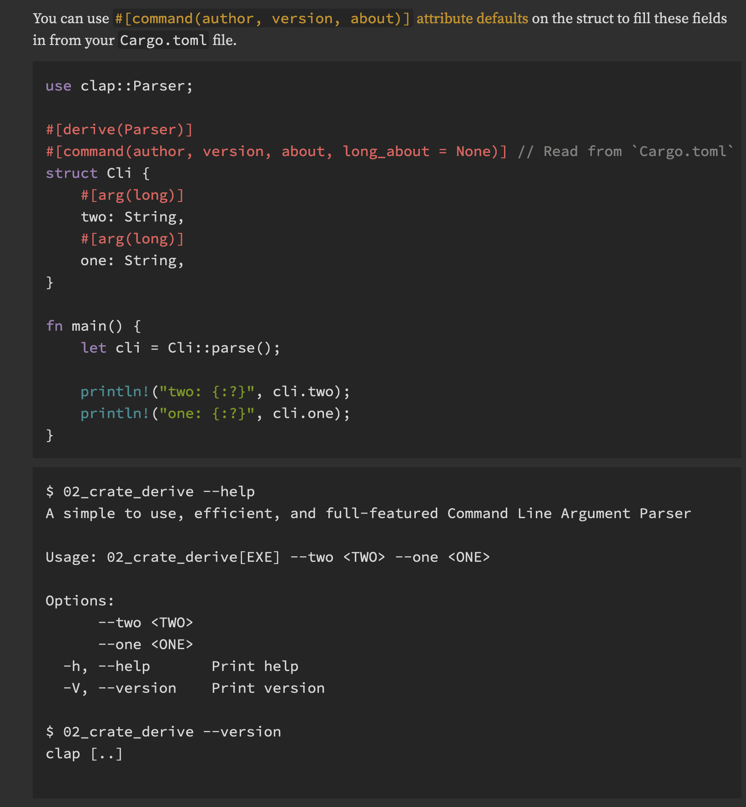

# Clap issue

TL;DR: It is [designed](https://github.com/clap-rs/clap/issues/4132) behaviour.

When using clap 4.4.x I can't seem to generate the author and version information as evidenced by the  screenshot below:



## Model

```
#[derive(Parser)]
#[command(author, version, about, long_about = None)] // Read from `Cargo.toml`
struct Cli {
    #[arg(long)]
    two: String,
    #[arg(long)]
    one: String,
}
```

However when using Clap version 3.2.20 with the same model, the author and version information is displayed:



```
#[derive(Parser)]
#[clap(author, version, about, long_about = None)] // Read from `Cargo.toml`
struct Cli {
    #[clap(long)]
    two: String,
    #[clap(long)]
    one: String,
}
```

Is this a possible bug? Or have I missed some other setting to display this information?

The link to the [4.4.12 documentation](https://docs.rs/clap/4.4.12/clap/_derive/_tutorial/chapter_1/index.html) for this feature also shows an example with author and version information not displayed, although it is supposed to. What am I missing?



The above sources can be found in `main.rs`
